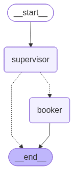
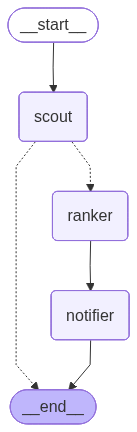

# Tableau — The Reservation Concierge Agent

> *The Bloomberg Terminal for the 600 restaurants where access* is *the product.*

A multi-agent system that monitors hard-to-book NYC restaurants on your behalf, explains *why* a slot fits when it opens, and books with one tap.

- **Live demo:** _set after `bash infra/deploy.sh` — see `.env.deploy`_
- **Business one-pager:** [docs/one-pager.md](docs/one-pager.md)
- **Architecture diagrams:** [chat graph](docs/chat_graph.png) · [tick graph](docs/tick_graph.png)
- **Course:** IEORE4576 Agentic AI for Analytics, Columbia, Spring 2026

---

## What it does

1. User signs in with name + email, gives the agent a watch — *"Don Angie, party of 2, next Friday between 7 and 10pm."*
2. Supervisor agent parses intent → registers a `Watch` with `auto_book=True`.
3. Every 2 minutes, a Scout sub-agent polls availability and hash-diffs against the last snapshot. **95% of ticks short-circuit on the hash — no LLM call.**
4. On a slot opening, a Ranker agent retrieves restaurant context (RAG) + user history and writes a personalized "why this fits" note.
5. An Auto-Booker agent drives a real Chromium browser (via Playwright) through the full booking flow on our TableTime sandbox — clicks the time, fills the form, submits, captures the confirmation.
6. A Notifier agent fires an in-app card and a real email via Resend with the confirmation code and a link to the confirmation page.

## Class concepts (rubric calls for 3+; we ship 6 + 2 bonuses)

| Concept | Where in the code | What to look at |
|---|---|---|
| **Tool calling** (Feb 16 lecture) | `backend/tools/reservation_tools.py` | 9 Pydantic-typed tool schemas converted to Gemini `FunctionDeclarations` in `backend/llm/client.py`; every agent decision is a tool call |
| **Multi-agent / orchestration** | `backend/agents/graph.py`, `backend/agents/{supervisor,scout,ranker,auto_booker,notifier,booker}.py` | LangGraph `StateGraph` — chat graph (Supervisor → Booker?) and tick graph (Scout → Ranker → Auto-Booker → Notifier) |
| **RAG / vector search** | `backend/rag/retriever.py`, `backend/rag/ingest.py` | Vertex AI `text-embedding-005` → Firestore vector index (numpy-cosine local fallback) |
| **Memory / state** | `backend/memory/state.py`, `backend/memory/firestore_store.py` | LangGraph `AgentState` TypedDict + Firestore-or-local-JSON store for user prefs / watches / snapshots |
| **Evaluation** (Feb 09 lecture) | `backend/evals/run_evals.py`, `backend/evals/cases.json`, `backend/evals/output/latest.json` | 20-case suite — intent / ranker / notifier — judged by Gemini-as-judge. Latest run: **19/20 (95%)** |
| **Context engineering** (Feb 02 lecture) | `backend/agents/prompts.py` | Per-agent system prompts versioned in code; user_id + today's-date injection; per-call `disable_thinking` for formatter tasks |

Bonuses:
- **Constrained decoding** (Feb 16 lecture) — every tool input is a Pydantic v2 model. We strip JSON-Schema features Gemini doesn't accept (`anyOf` with `null`, `$defs`, etc.) in `backend/llm/client.py:_clean_schema`. Outputs are guaranteed-shape.
- **Real browser automation** — `backend/booking/browser_booker.py` opens Chromium (Playwright) and completes the full booking against our `TableTime` sandbox (`backend/api/fake_resy.py`).

## Architecture




## Tech stack & why

| Choice | Why this for *this* business |
|---|---|
| **LangGraph** | Multi-agent orchestration is the rubric concept the panel will scrutinize most. The graph is screenshottable. State `TypedDict` doubles as the memory primitive. |
| **Google Gemini 2.5 Flash via Vertex AI** | Bills against GCP credits — zero out-of-pocket while we iterate. Flash is cheap enough ($0.30 / $2.50 per M tokens) that the 5% LLM-touched scout cost is dwarfed by infra. The `LLMResponse` abstraction in `backend/llm/client.py` is provider-agnostic — swap to Anthropic with one env var. |
| **Firestore (incl. vector search)** | Replaces Cloud SQL + pgvector + Memorystore in one service — single-digit-cents/user/month at our scale, scales to millions without re-architecting. Local JSON fallback for dev so the agent stack boots without enabling APIs. |
| **Cloud Run, min-instances=0** | Idle cost approaches zero. Margin holds from user 1. |
| **Cloud Scheduler → /internal/tick** | Cron-as-a-service. No Pub/Sub topic, no Cloud Tasks queue — saves a day of plumbing and ~$5/mo minimum spend. |
| **Streamlit (themed)** | 2-day delta vs Next.js. The user buys *the agent's intelligence*, not pixel-perfect UI. Editorial type + cream/black/gold gets us 80% there at 20% of the cost. |
| **Resend** for email | Real delivery with one API key; 3,000 free emails/mo covers cold-start. The wrapper falls back to Gmail SMTP and console-only so dev never crashes on missing creds. |
| **Playwright + TableTime sandbox** | The agent really books — opens a browser, fills a form, submits, gets a confirmation. We drive a site we own (sandboxed Resy clone) so no ToS exposure and no broken selectors. The architecture is the same path a Resy partnership would take; we flip `USE_FAKE_RESY=false` in prod. |
| **Mock provider behind an interface** | `ReservationProvider` interface with `MockResyProvider` (used everywhere) and `LiveResyProvider` (stub, never enabled). The day a partnership exists, we flip a flag. |

## Run locally

```bash
git clone <repo-url> reservation-concierge
cd reservation-concierge

# 1. Create venv + install
python3.11 -m venv .venv
source .venv/bin/activate
pip install -r requirements.txt

# 2. Configure
cp .env.example .env
# Edit .env: GCP_PROJECT_ID is required for Vertex AI Gemini.
# Authenticate gcloud once: `gcloud auth application-default login`.
# Optional: RESEND_API_KEY for real email delivery.

# 3. Seed the restaurant knowledge base
python -m backend.rag.ingest

# 4. Run the eval suite (sanity, ~$0.005)
python -m backend.evals.run_evals

# 5. Start the API
uvicorn backend.api.main:app --reload --port 8000

# 6. In another terminal, start the UI
streamlit run frontend/streamlit_app.py

# 7. (Optional) Install Playwright Chromium for the auto-book demo
playwright install chromium
```

Open <http://localhost:8501>.

## Deploy to GCP

```bash
# One-time setup (replace PROJECT_ID)
gcloud config set project PROJECT_ID
gcloud services enable \
  run.googleapis.com \
  cloudscheduler.googleapis.com \
  firestore.googleapis.com \
  aiplatform.googleapis.com \
  secretmanager.googleapis.com \
  cloudbuild.googleapis.com

# Build + deploy
bash infra/deploy.sh
```

The script provisions both Cloud Run services, the Firestore vector index, the Cloud Scheduler cron, and writes the URLs to `.env.deploy`.

## Repo layout

```
reservation-concierge/
├── backend/
│   ├── agents/             # 6-node LangGraph (multi-agent class concept)
│   │   ├── graph.py            # StateGraph wiring + diagram render
│   │   ├── supervisor.py       # chat-mode entrypoint, tool-use loop
│   │   ├── scout.py            # cron polling + hash-diff
│   │   ├── ranker.py           # RAG-enriched scoring + rationale
│   │   ├── auto_booker.py      # tick-mode: drives Playwright booking
│   │   ├── booker.py           # chat-mode HITL booking (legacy)
│   │   ├── notifier.py         # in-app card + email payload formatter
│   │   └── prompts.py          # versioned system prompts (context engineering)
│   ├── tools/              # Pydantic-typed tool schemas (tool-use class concept)
│   ├── rag/                # ingest + retriever (RAG class concept)
│   ├── memory/             # State + Firestore-or-local store (memory class concept)
│   ├── evals/              # 20-case suite + Gemini-as-judge (evals class concept)
│   ├── providers/          # ReservationProvider interface + MockResyProvider
│   ├── booking/            # deep_links.py + browser_booker.py (Playwright)
│   ├── llm/                # Vertex AI Gemini client + cost ledger
│   ├── notifications/      # email.py: Resend / Gmail SMTP / console
│   ├── api/                # FastAPI app + fake-resy sandbox routes
│   └── config.py           # Pydantic settings
├── frontend/
│   ├── streamlit_app.py    # Themed Streamlit UI (sign-in → home → demo)
│   └── static/             # CSS + screenshots from browser-booker runs
├── infra/
│   ├── Dockerfile
│   ├── entrypoint.sh
│   ├── cloudbuild.yaml
│   └── deploy.sh
├── docs/
│   ├── one-pager.md        # Business doc (rubric submission)
│   ├── pitch-deck-outline.md
│   ├── chat_graph.png
│   └── tick_graph.png
├── seed_data/
│   ├── restaurants.json    # 30 NYC hard-to-book restaurants
│   └── fixtures.json       # demo replay events
├── tests/
│   └── smoke_no_llm.py
└── README.md
```

## Team

- Myriam Bengoechea Pardo (`mb5500`)
- Blanca Valera Caballero (`bv2358`)

## License

MIT — see [LICENSE](LICENSE).
